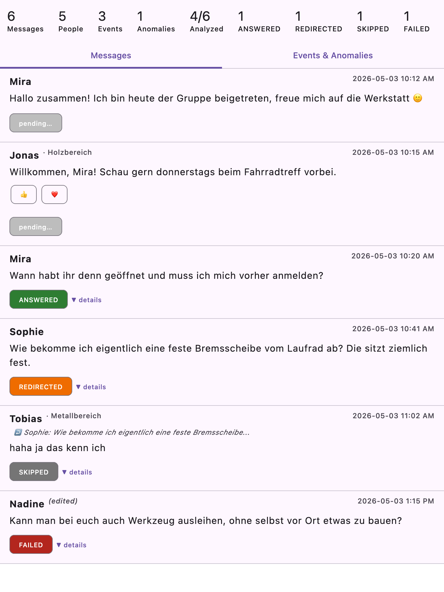

# Signal FAQ Bot

Standalone bot for **35services g.e.V.** that watches a Signal group, and answers
member questions automatically by asking a local LLM — grounded in the workshop's
FAQ and its live calendar. This replaces the current setup where an agent
(`INSTRUCTIONS.md`) manually follows a runbook; the goal here is a small
long-running Kotlin service that does the same job unattended.

## Requirements

### Signal integration
- Monitor one Signal group ("Offener Kanal 35services") for new incoming messages.
- Use the `signal-cli` Docker image built by
  [35services/simple-filament-tool](https://github.com/35services/simple-filament-tool)
  (its `Dockerfile` / `signal-cli-docker.sh`, run against a `signal-state` volume
  linked to the workshop's Signal number) — the same mechanism that project
  already uses to *send* Signal notifications, reused here for both receiving
  and sending.
- Every reply is sent as a **direct message to the sender's phone number**,
  never back into the group.

### Filtering: who gets an automated answer
Not every message in the group is a question for the bot — people chat with
each other, reply to someone else's message, or ask something the FAQ/calendar
just can't answer. Before a message reaches the answer pipeline:
1. **Member skip-list** (`signal.memberAccounts` in config) — messages from
   these phone numbers are never auto-answered at all. They're assumed to be
   internal chat between people who already know the FAQ, not questions for
   the bot. This check is free (no LLM call).
2. **Gate chain** — everyone else's message runs through every
   `templates/classify*.txt` file, in alphabetical filename order. Each gate
   asks the LLM a plain yes/no *"should this message keep moving through the
   chain?"*. The first `NO` stops it:
   - If a matching `templates/answer<suffix>.txt` exists (e.g.
     `classify_practical.txt` <-> `answer_practical.txt`), that **static**
     message is sent instead of a generated answer.
   - If no matching answer file exists (e.g. `classify_0_is_question.txt`),
     the message is just skipped — no reply at all.
   - A message that gets a `YES` from every gate proceeds to the full
     FAQ/calendar answer pipeline below.

   Shipped gates, in the order they run:
   - `classify_0_is_question.txt` — is this a standalone question at all, as
     opposed to chit-chat/a reply? (no matching answer file -> silent skip)
   - `classify_practical.txt` — is this answerable from FAQ/calendar, as
     opposed to a practical how-to/repair question? (pairs with
     `answer_practical.txt` -> static redirect message)

   Adding a new gate is just adding a `templates/classify_<name>.txt` file
   (and, optionally, a matching `templates/answer_<name>.txt`) — no code
   change needed. See "Testing the gate chain" below.

Messages stopped by either the member skip-list or a gate are recorded as
`SKIPPED`/`REDIRECTED` in the state file (with which gate stopped them) —
same restart-safety guarantee as answered/failed messages, they're just
never picked up again.

### Answering a message
For each message that passes every gate, gather three inputs and combine
them into one LLM prompt:
1. **The incoming message** (text + sender number + language it's written in).
2. **FAQ.md** — the static list of standard questions/answers.
3. **Live calendar** — next ~2 weeks of events, fetched fresh per message
   (reusing the logic in `fetch-calendar.py`: pulls the public Google Calendar
   ICS feed, expands recurring events, flags anything with "Intern" in the
   title/description so it can be excluded from the answer).

The LLM only ever sees what the prompt template puts in front of it — no tool
use, no multi-turn back-and-forth. One prompt in, one answer out.

### Prompting is templated, not hardcoded
- Prompt assembly must go through an external, editable template (not a Kotlin
  string baked into the code), so the wording/instructions can be tuned later
  without a rebuild. Placeholders for: the FAQ text, the calendar dump, the
  incoming message, sender language, and any other framing text ("You are the
  friendly assistant of 35services...", tone rules, the volunteering
  disclaimer, the "forward if unknown" fallback — all the stuff currently
  living in `INSTRUCTIONS.md`).
- The final message sent back to the user is **also templated**: some
  hardcoded framing text/boilerplate around the raw LLM output (e.g. a
  greeting, a signature, a "this was answered automatically" note) — separate
  from the prompt template.

### Local LLM, pluggable backend
- Must run against a **local** LLM, configurable between two backends:
  - **Ollama** — any model already pulled locally (e.g.
    `ollama run glm-4.7-flash:latest "hello world"` as the baseline shape of a
    call, though the bot should talk to Ollama's HTTP API rather than shelling
    out to the CLI).
  - **Apfel** (Apple Intelligence via the `apfel` CLI tool).
- Backend + model selectable via config, no code change needed to switch.

### State / processing log
- A state file (successor to `last-answered.json`) tracks, per incoming
  message: message id/timestamp, sender, and a status —
  `received → processing → answered` / `failed` / `skipped`. Since LLM
  processing can take a noticeable amount of time, a message must be marked
  `processing` *before* the LLM call starts, so a crash/restart mid-processing
  doesn't cause it to be silently dropped or double-answered.
- On startup, the bot resumes from this file rather than re-answering
  everything from scratch.

### Non-functional / carried over from `INSTRUCTIONS.md`
- Reply in the same language as the incoming message (German or English).
- Friendly, brief, informal tone (no "Sie").
- Always mention the volunteering disclaimer when opening-hours are discussed.
- Never surface events marked "Intern".
- If neither FAQ nor calendar cover the question, send the
  "forwarding your question" fallback instead of guessing.

### Web dashboard
- A small read-only status page shows the current **queue** (received/processing)
  and the **history** of answered/failed messages, rendered straight from the
  state file — no separate database.

## Tech stack

Kotlin + [Ktor](https://ktor.io) (JetBrains' own, coroutine-native — currently
the most idiomatic "simple server" in the Kotlin space, much lighter than
Spring Boot), Gradle (Kotlin DSL), `kotlinx.serialization` for JSON,
`kotlinx.coroutines` for the poll loop. Ktor is used less as a "server" and
more for its HTTP **client** (talking to Ollama's REST API) and, now, its
tiny **server** for the dashboard.

- **Signal**: shells out to `signal-cli` (via the Docker image from
  [35services/simple-filament-tool](https://github.com/35services/simple-filament-tool))
  on a poll loop, `receive -o json`. See "Future: signal-cli daemon (JSON-RPC)"
  below for the lower-latency alternative deliberately not built yet.
- **Calendar**: shells out to `fetch-calendar.py`, wrapped in `Dockerfile.calendar`
  so no local Python setup is required. Reimplementing its ICS/recurrence
  logic in Kotlin would just be a second copy to keep in sync.
- **Templating**: dumb `{{placeholder}}` substitution in plain `.txt` files
  under `templates/` — no templating library. `templates/classify*.txt` files
  are the gate chain (see "Filtering" above); `templates/prompt.txt` builds
  the answer prompt; `templates/answer.txt` wraps the LLM's raw output into
  the message actually sent.
- **Filtering**: `GateDiscovery` scans `paths.templatesDir` for
  `classify*.txt` files and pairs each with its `answer*.txt` (if any) into a
  `ClassificationGate`; `GatePipeline` runs them in order, using the same
  `LlmClient`/provider as answering. Gates `AnswerService` from inside
  `BotLoop`, alongside the `signal.memberAccounts` skip-list.
- **LLM**: `LlmClient` interface with `OllamaLlmClient` (HTTP, `POST /api/generate`,
  `stream: false`, `think: false`) and `ApfelLlmClient` (shells out to `apfel`),
  chosen via `llm.provider` in config.
- **State**: `JsonFileStateStore` — a single JSON array, rewritten via
  temp-file-then-rename on every change. One workshop's Signal group, not a
  firehose; no database needed.

## Building & running

Requires a **JDK 21 toolchain** — the Kotlin 2.0.21 compiler bundled here
crashes parsing very new `java.version` strings (confirmed against a system
JDK 26). If `java -version` shows something newer than 21, install one
(`brew install openjdk@21`) and either export `JAVA_HOME` before running
Gradle, or set `org.gradle.java.home` in a local (gitignored) `gradle.properties`.

```bash
# one-time setup
cp config.example.json config.json        # fill in signal.account/groupId, llm.model
docker build -f Dockerfile.calendar -t signal-faq-bot-calendar .

./gradlew build                            # compiles + runs the test suite
./gradlew run --args="ask \"Wann habt ihr auf?\" --sender +491701234567"
./gradlew run --args='classify "haha bis morgen!"'   # dry-run the whole gate chain
./gradlew run --args="run"                 # starts polling + the dashboard on :8080
```

`ask` always answers (it skips every gate — it's for testing the answer
pipeline itself, `templates/prompt.txt`/`templates/answer.txt`, or trying a
different model). See `Cli.kt`'s usage text (`./gradlew run` with no args)
for all flags.

### Testing the gate chain
- `./gradlew run --args='classify "<message>"'` runs the **whole chain** and
  prints what the bot would do (which gate stopped it and how, or that it
  would answer) — the go-to command when tuning a gate's wording.
- `./gradlew run --args='<gate-name> "<message>"'` runs **one gate** in
  isolation and prints `YES`/`NO`. `<gate-name>` is any
  `templates/classify*.txt` filename minus `.txt`, e.g.
  `./gradlew run --args='classify_practical "Wie loete ich das?"'`.
- `./gradlew run --args="benchmark"` runs the whole chain against
  `benchmarks/answerable.txt` (expected to pass every gate) and
  `benchmarks/practical.txt` (expected to get redirected) using the real
  configured LLM, and reports a PASS/FAIL per line plus a summary — the tool
  for judging prompt/model changes against a fixed set of real examples
  rather than eyeballing one message at a time. Add real messages you've
  collected from the group to those two files (one per line, `#` for
  comments) to grow the benchmark over time.

Note: don't run `ask`/`classify`/`benchmark`/a single-gate command from a
second terminal *while* `run` is active against the same Ollama instance —
they're separate OS processes hitting the same local LLM, and `BotLoop`
itself is already strictly sequential (one message, one LLM call at a time;
see `CLAUDE.md`), but two separate processes racing for Ollama isn't
something the code coordinates.

## Chat export analysis (separate, work-in-progress tool)

A second, unrelated tool is starting to grow alongside the bot: parsing a
Signal Desktop chat export (plain-text copy/paste from the conversation
view) into JSON, so a future pass can run the bot's gate/answer logic
against real historical messages and see how people actually reacted.

```bash
./gradlew run --args='parse-chat reference/chat.txt'   # -> reference/chat.txt.json
```

`reference/` is gitignored — real chat exports contain real names and
messages and should never be committed. `ChatExportParser` (see its class
doc and `CLAUDE.md`'s "chat export parser" section) reverse-engineers the
export's line shapes: messages (sender, text, timestamp, reactions,
quote-reply info), and join/leave/group-update events. Read the printed
anomaly list after running it — some ambiguity in the source format (e.g. a
link preview's own lines vs. typed text) is fundamentally unresolvable from
plain text alone and is called out rather than guessed at.

Once you have a `parse-chat` export, `analyze-chat` replays every message
through the real gate chain and `AnswerService`, and `chat-viewer` gives you
a Compose Desktop UI to browse the results as they land:

```bash
./gradlew run --args='analyze-chat reference/chat.txt.json'   # resumable; can take a while
./gradlew :chat-viewer:run --args="reference/chat.txt.json"   # live-polls the analysis file above
```



(That screenshot is invented sample data, not a real export — rendered
headlessly via `./gradlew :chat-viewer:screenshot`, see that task and
`Screenshot.kt` for how to regenerate it after a UI change.)

## Future: signal-cli daemon (JSON-RPC)

Not built — polling `receive` is simpler and good enough for one group's
traffic — but kept here as the documented upgrade path if poll latency
(`signal.pollIntervalSeconds`) ever becomes a problem:

```bash
signal-cli -a +<account> daemon --http-port 8080
```

This exposes a JSON-RPC API; messages arrive as they're delivered instead of
on a fixed interval (subscribe over its WebSocket, or long-poll `receive` via
JSON-RPC). Switching means replacing `SignalCliClient.receiveMessages()` with
a client that talks JSON-RPC/WebSocket instead of shelling out per poll —
`SignalClient` is already an interface for exactly this kind of swap.

## Known limitations / not handled yet
- `cliCommand`/`apfelCommand`/`calendarCommand` are split on literal spaces —
  fine for the documented `docker run ...` shapes, but a path containing a
  space would break it.
- No de-dup beyond message id; if `signal-cli receive` ever redelivers a
  message with a new id, it would be answered twice.
- The dashboard is unauthenticated — fine on `localhost`, not meant for
  exposure beyond that.
- Every eligible message costs one LLM call per gate it passes, plus one more
  to answer — fine for one workshop's group traffic; if that ever matters, a
  cheaper/smaller model just for the gate chain would be the first thing to
  try.
- Each gate sees only the message text in isolation, no surrounding chat
  context — it can't tell a reply from a fresh question if the reply happens
  to read like one on its own. The benchmark command (see above) is how you
  find out how often that actually happens with real examples.
- Gate accuracy is inherently probabilistic (same model, same prompt, can
  answer differently run to run) — confirmed directly while building this:
  `classify_0_is_question` occasionally misclassified a clearly-standalone
  practical question as "not a question" and silently skipped it instead of
  reaching `classify_practical`'s redirect. Widening
  `benchmarks/answerable.txt`/`benchmarks/practical.txt` with real examples
  and rerunning `benchmark` is the way to quantify and improve this, not a
  one-off prompt tweak.
